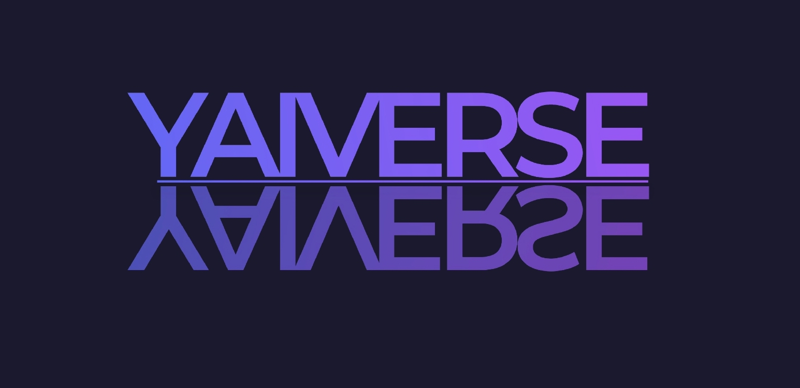
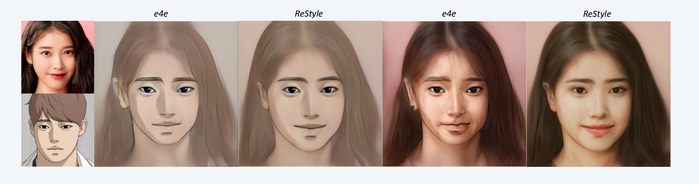
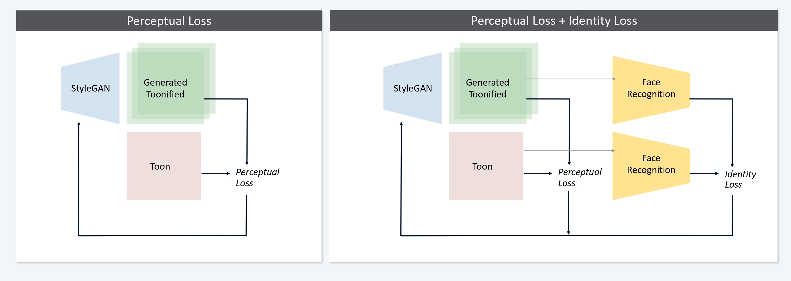
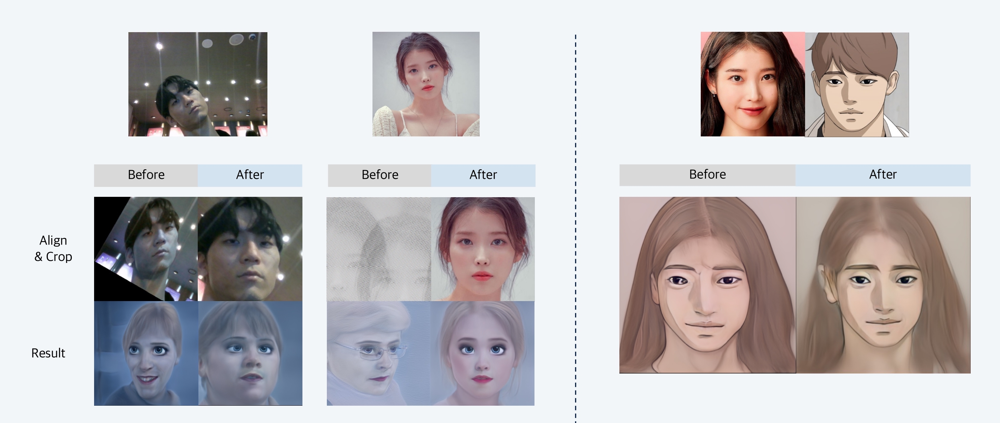

---
</br>
<h3 align="center"> 1st YAICON : TOP prize </h3>
</br>

---

### Members ###
<b>
☠️ LEE SANGMIN  :  YAI 9th / FE / Lead </br>
🌈 KIM MINSU  :  YAI 7th / AI / Lead </br>
🐋 KIM JUYEON  :  YAI 8th / AI / Design </br>
🦄 PARK CHANHYUK  :  YAI 9th / BE / AI </br>
🎄 LEE CHANMI  :  YAI 9th / AI </br>
🎅🏼 KIM JISOO  :  YAI 10th / AI </br>
</b>
</br>

---

## 1. Requirements ##

### Environment Setting ###
```
  conda env create --file yaiverse.yml
  conda activate yaiverse
  pip install mediapipe
```

Library requirements
- pytorch > 1.7
- torchvision corresponding pytorch version
- cudatoolkit (or pytorch1.X+cu1x.x)
- mediapipe

</br>

---

## 2. Prepare ##

### Clone repos ###
```
  git clone https://github.com/minsu1206/YAIVERSE.git
  cd YAIVERSE
  git clone https://github.com/yuval-alaluf/restyle-encoder
```
: cloning restyle for inversion.

: if you want to use e4e (not recommended), you can skip 3rd command line

</br>

### Download pretrained models ###
: Download pretrained
1. e4e inversion model's pt file and locate it on /jojogan/models
2. stylegan2 model's pt file and locate it on /jojogan/models
3. restyle model's pt file and locate it on /restyle_encoder/pretrained_models

</br>

### Data ###
1. locate your face image at dataset/real
2. locate your target image at dataset/styles

or you can use our examples : IU for real face & leedoona for styles

</br>

## 3. Finetune ##
```
  cd jojogan
  python newstyle_finetune_vf.py --img_path ../dataset/real/image.png --style_dir ../dataset/styles --style_name leedoona --style_img_name leedoona_6.jpg --output_dir ../results
```

Finetuning may takes some minutes. </br>

---

## 4. Contributions : AI ##

YAIVERSE is mainly based on https://github.com/mchong6/JoJoGAN. However, this repository is significantly different from paper(https://arxiv.org/abs/2112.11641)'s implementation details and some results are not desirable.

At this point, we focused on implementing ommitted details and validate our methods by lots of experiments.

Our contributions are
1. Use Restyle model for inversion and integrate it into jojogan finetuning process
2. Implement identity loss to prevent drastic change during finetuning
3. Implement new face align algorithm (better than jojogan's face align code) by using mediapipe model and its face mesh template
</br>


### Details about our contributions ###

#### Restyle ####


> Training with ReStyle leads to clean stylization that accurately preserves the features and proportions of the input face. - JOJOGAN Appendix A.1



Real face: IU & Style face : FreeDraw

Left two images are results of inversion & reconstruction

Right two images are results of forwarding finetuned stylegan (jojogan)

ReStyle is better than e4e for toonify!

#### Face Recognition ####


> Some style references distort the original identity of the inputs. In such cases, writing sim for cosine similarity and F for a pretrained face embedding network, we use eq(3) to compel the finetuned network to preserve identity; - JOJOGAN 4.Variants

perceptual loss → stabilize GAN training when averaged over batches

${L}(G(s_i;\theta), y)=||D(G_i;\theta))-D(y)||_1$

identity loss → compel the finetuned network to preserve identity

${L}_{id} = 1-sim(F(g(s_i;\theta)), F(g(s_i;\hat{\theta})))$

#### Face Align code ####



Original face aligning algorithm often makes strange results. we assumed that the performance of dlib's face landmark detector is low or the algorithm doesn't work well. So, we replace dlib model with mediapipe model and change algorithm to use calculate orientation of face by warping detected landmark into mediapipe canonical face mesh model.

Our algorithm shows better performance (both accuracy and speed!). This leads to better inversion & finetuning at our experiments.

---


